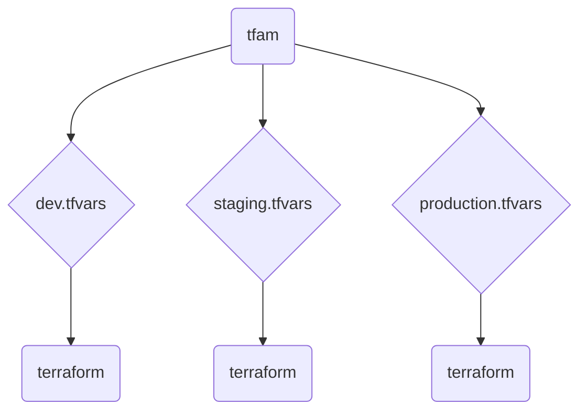

<br />
<p align="center">
  <a href="">
    
  </a>
      <h1 align="center">Terraform Apply Manager</h1>
  <p align="center"><i>A Rust-based wrapper for concurrent Terraform apply, enabling multi-deployment support.</i></p>
</p>

---

*tfam* stands for *"Terraform Apply Manager"*

## How it works



## Specifications

Terraform Apply Manager interacts with the Terraform binary and provides the following features:

- **Non-invasive**: It reads and uses `.tf` and `.tfvars` files as they are, even if they have been modified by the user. This ensures that the user maintains full control over their configuration files and prevents interference with other processes that may also be using those files.
- **Non-destructive**: It preserves any Terraform options and commands that are passed to it, and passes them on to the Terraform binary unchanged. This ensures that the behavior of the Terraform binary remains the same, and that any options or commands provided by the user are respected. The tool/script may add additional functionality, but it should not modify or remove any existing functionality.

By providing these features, Terraform Apply Manager offers a seamless and flexible way to interact with the Terraform binary, without interfering with the user's workflow or modifying the behavior of the binary.

## Installation

To install tfam, simply run the install.sh script provided in this repository. The script will automatically download and install the necessary dependencies, and set up tfexe on your system.

```shell
wget -q -O -  https://raw.githubusercontent.com/Ant0wan/tfam/master/install.sh | sh
```

## Usage

To use **tfam**, you can set the following environment variables or provide command-line options:

**TFAM_EXE**: Set the Terraform executable path or binary to be used by **tfam**. For example:

```shell
TFAM_EXE=tfexe tfam init
TFAM_EXE=terraform tfam init
TFAM_EXE=path/to/your/binary tfam init
```

**TF_WORKSPACE_FORMAT**: This environment variable defines an awk-like format for generating workspace names based on file paths. The placeholders **$1**, **$2**, etc., represent segments of the file path, with **$1** corresponding to the first segment and **$-1** corresponding to the last segment. For example:

```shell
export TF_WORKSPACE_FORMAT='myworkspace-$2_$1_$3'
export TF_WORKSPACE_FORMAT='$-3_$-1_$-2'
```

Command-line options:

`-interactive`: Enables an interactive selection menu for certain operations.

`-concurrent`: Allows running operations concurrently.

`-var-file`: Specifies one or more variable files to be used. For example:

```shell
tfam plan -var-file /path/to/file1 -var-file /path/to/file2
```

Please note that the specific functionalities and behavior may vary depending on the version of **tfam** and the Terraform version being used.

## Configuration

### Autocompletion

```shell
complete -W "-interactive -concurrent -workspace-format" -d -f -C $(which terraform) tfam
```

## Coming features

When performing `workspace` command + -interactive, it will display a workspace menu list.

## License

This repository is protected by the GPL3 (GNU General Public License v3.0). You can find the full text of the license in the LICENSE file. Please review and comply with the terms and conditions of the GPL3 license before using or contributing to this project.

For any questions, bug reports, or contributions, please feel free to open an issue or submit a pull request. Thank you for using tfam!
