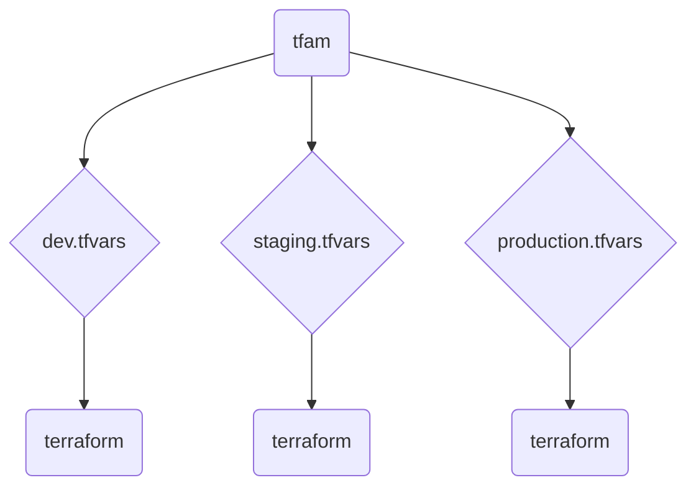

 

  
      <h1 align="center">Terraform Apply Manager</h1>
  
<i>A Rust-based wrapper for concurrent Terraform apply, enabling multi-deployment support.</i>

---

*tfam* for *"Terraform Apply Manager"*

### How it works

