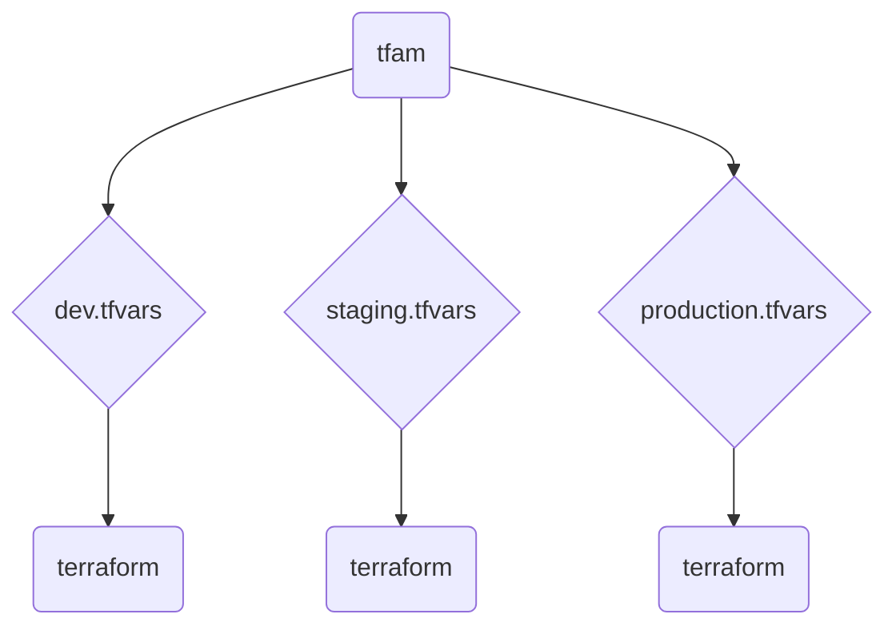

 

  
      <h1 align="center">Terraform Apply Manager</h1>
  
<i>A Rust-based wrapper for concurrent Terraform apply, enabling multi-deployment support.</i>

---

*tfam* stands for *"Terraform Apply Manager"*

## How it works

## License

This repository is protected by the GPL3 (GNU General Public License v3.0). You can find the full text of the license in the LICENSE file. Please review and comply with the terms and conditions of the GPL3 license before using or contributing to this project.

For any questions, bug reports, or contributions, please feel free to open an issue or submit a pull request. Thank you for using tfam!
